# Système de Communication Sécurisée

Un système de communication sécurisée implémenté en Python basé sur le modèle **Pretty Good Privacy (PGP)**, permettant l'échange de messages chiffrés et signés numériquement entre un client et un serveur.

## Objectif du Projet

Ce projet implémente un système de communication sécurisée qui démontre les principes fondamentaux de la cryptographie moderne :

- **Confidentialité** : Chiffrement des messages avec RSA
- **Authenticité** : Signature numérique pour vérifier l'expéditeur
- **Intégrité** : Détection de toute modification des données
- **Non-répudiation** : Preuve de l'origine du message

---

## ✨ Fonctionnalités

### 🖥️ Serveur PGP (`serveur.py`)

- ✅ Génération automatique de clés RSA (2048 bits)
- ✅ Écoute multi-clients sur socket TCP
- ✅ Déchiffrement des messages entrants
- ✅ Vérification automatique des signatures numériques
- ✅ Affichage sécurisé des messages authentifiés
- ✅ Gestion des erreurs et logs détaillés

### 📱 Client PGP (`client.py`)

- ✅ Génération de clés RSA uniques par session
- ✅ Signature numérique des messages (SHA-256 + RSA-PSS)
- ✅ Chiffrement avec la clé publique du serveur
- ✅ Interface utilisateur intuitive
- ✅ Mode test automatisé intégré
- ✅ Validation des données avant envoi

### 🔴 Simulateur d'Attaque (`hacker.py`)

- ⚠️ Simulation d'attaque par usurpation d'identité
- 🔓 Génération de fausses clés RSA d'attaquant
- 🎭 Tentative de signature avec une clé incorrecte
- 📡 Envoi de paquets malveillants au serveur
- 🛡️ Démonstration de la robustesse du système de vérification
- 📚 Outil pédagogique pour comprendre les vulnérabilités

---

## 🛠️ Prérequis et Installation

### Prérequis Système

- **Python 3.7+** (testé avec Python 3.8-3.11)
- **Système d'exploitation** : Windows, macOS, Linux

### Installation des Dépendances

```bash
# Installation de la bibliothèque cryptographique
pip install cryptography
```

---

## 🚀 Utilisation

### Démarrage du Serveur

```bash
# Terminal 1
python serveur.py
```

**Sortie attendue :**
```
🔐 Serveur PGP initialisé
📋 Clés RSA générées (2048 bits)
🌐 Écoute sur localhost:8888
⏳ En attente de connexions...
```

### Démarrage du Client

```bash
# Terminal 2
python client.py
```

**Interface client :**
```
📱 Client PGP 🔐
Client PGP initialisé pour localhost:8888
📋 Clés RSA du client générées avec succès

💬 Que souhaitez-vous faire ?
1. Envoyer un message sécurisé
2. Quitter

👉 Votre choix (1-2): 1
✍️ Entrez votre message: Bonjour, message secret!
```

### Simulation d'Attaque (Hacker)

```bash
# Terminal 3 (avec le serveur déjà en cours d'exécution)
python hacker.py
```

**Interface de l'attaquant :**
```
==================================================
DÉBUT DE L'ATTAQUE
==================================================

Options:
1. Lancer une attaque
2. Quitter

Choix (1-2): 1
Message à envoyer: Message malveillant

Lancement de l'attaque...
Connexion au serveur...
Clé publique récupérée
Préparation du paquet...
Paquet envoyé

Résultat:
- Signature invalide (clé incorrecte)
- Le serveur détecte l'usurpation
```

### Mode Test Automatisé

Pour tester rapidement le système, décommentez la ligne dans `client.py` :

```python
if __name__ == "__main__":
    test_rapide()  # Décommentez cette ligne
    # main()       # Commentez celle-ci
```

---

## 🔒 Architecture de Sécurité

### Algorithmes Utilisés

| Composant | Algorithme | Détails |
|-----------|------------|---------|
| **Chiffrement asymétrique** | RSA-2048 | Clés de 2048 bits, exposant 65537 |
| **Padding de chiffrement** | OAEP | Optimal Asymmetric Encryption Padding |
| **Fonction de hachage** | SHA-256 | Pour l'intégrité et la signature |
| **Signature numérique** | RSA-PSS | Probabilistic Signature Scheme |
| **Transport** | TCP Socket | Communication réseau sécurisée |

### Processus de Communication Sécurisée

```mermaid
sequenceDiagram
    participant C as Client
    participant S as Serveur

    Note over C,S: Échange de clés
    C->>S: Connexion TCP
    S->>C: Clé publique serveur

    Note over C,S: Préparation du message
    C->>C: Génération signature (clé privée client)
    C->>C: Chiffrement message (clé publique serveur)

    Note over C,S: Transmission sécurisée
    C->>S: Paquet {message_chiffré, signature, clé_publique_client}

    Note over C,S: Vérification et déchiffrement
    S->>S: Déchiffrement (clé privée serveur)
    S->>S: Vérification signature (clé publique client)
    S->>S: Affichage message authentifié
```



### Simulation d'Attaque par Usurpation

```mermaid
sequenceDiagram
    participant H as Hacker
    participant S as Serveur

    Note over H,S: Tentative d'usurpation
    H->>S: Connexion TCP
    S->>H: Clé publique serveur

    Note over H,S: Préparation de l'attaque
    H->>H: Génération de SES propres clés
    H->>H: Signature avec SA clé privée (incorrecte)
    H->>H: Chiffrement message (correct)

    Note over H,S: Envoi du paquet malveillant
    H->>S: Paquet {message_chiffré, FAUSSE_signature, fausse_clé_publique}

    Note over H,S: Détection de l'attaque
    S->>S: Déchiffrement (réussi)
    S->>S: Vérification signature (ÉCHEC)
    S->>S: Rejet du message - Attaque détectée
```



---

## 📁 Structure du Projet

```
systeme-pgp/
├── serveur.py          # Serveur PGP principal
├── client.py           # Client PGP avec interface utilisateur
├── hacker.py           # Simulateur d'attaque par usurpation
├── README.md           # Documentation (ce fichier)
```

---

## 🔧 Configuration

### Paramètres Modifiables

**Dans `serveur.py` :**
```python
# Configuration réseau
HOST = 'localhost'      # Adresse d'écoute
PORT = 8888            # Port d'écoute

# Configuration cryptographique
KEY_SIZE = 2048        # Taille des clés RSA
```

**Dans `client.py` :**
```python
# Configuration serveur cible
SERVER_HOST = 'localhost'
SERVER_PORT = 8888

# Messages de test prédéfinis
messages_test = [
    "Votre message personnalisé",
    "Autre message de test"
]
```

**Dans `hacker.py` :**
```python
# Configuration de l'attaque
HOST = "172.20.10.3"    # Adresse IP du serveur cible
PORT = 8888             # Port du serveur cible

# L'attaquant génère ses propres clés
# mais tente d'usurper l'identité d'un client légitime
```

### Utilisation sur Réseau Local

Pour utiliser le système sur un réseau local :

1. **Serveur** : Modifiez `HOST = '0.0.0.0'` dans `serveur.py`
2. **Client** : Modifiez `SERVER_HOST = 'IP_DU_SERVEUR'` dans `client.py`
3. **Hacker** : Modifiez `self.host = 'IP_DU_SERVEUR'` dans `hacker.py`
4. **Firewall** : Assurez-vous que le port 8888 est ouvert

---

## 🧪 Tests et Démonstration

### Test de Base

```bash
# Terminal 1
python serveur.py

# Terminal 2
python client.py
# Suivez l'interface pour envoyer un message
```

### Test d'Attaque et Sécurité

```bash
# Terminal 1 - Serveur
python serveur.py

# Terminal 2 - Client légitime
python client.py
# Envoyez un message valide

# Terminal 3 - Attaquant
python hacker.py
# Tentez une attaque par usurpation
```

**Résultat attendu :**
- ✅ Le message du client légitime est accepté
- ❌ L'attaque de l'usurpateur est détectée et rejetée
- 🛡️ Le serveur affiche une erreur de signature invalide

### Test Automatisé

```bash
# Modifiez client.py pour activer test_rapide()
python client.py
```

### Vérification des Composants

**Test de génération de clés :**
```python
python -c "
from cryptography.hazmat.primitives.asymmetric import rsa
cle = rsa.generate_private_key(public_exponent=65537, key_size=2048)
print(f'✅ Clé générée: {cle.key_size} bits')
"
```

**Test de signature :**
```python
# Testez la signature dans un script séparé
import hashlib
from cryptography.hazmat.primitives.asymmetric import rsa, padding
from cryptography.hazmat.primitives import hashes

# Test complet de signature/vérification
message = "Test de signature"
cle_privee = rsa.generate_private_key(public_exponent=65537, key_size=2048)

# ... (voir le code source pour l'implémentation complète)
```

---

## 🛡️ Analyse de Sécurité

### Vulnérabilités Simulées par `hacker.py`

#### 🔴 Attaque par Usurpation d'Identité

**Scénario :**
- L'attaquant génère ses propres clés RSA
- Il tente de se faire passer pour un client légitime
- Il signe le message avec SA propre clé privée (incorrecte)
- Il peut envoyer une fausse clé publique

**Défense du Système :**
- ✅ Vérification cryptographique de la signature
- ✅ Détection automatique des signatures invalides
- ✅ Rejet des messages non authentifiés
- ✅ Logging des tentatives d'attaque

#### 🟡 Limitations de l'Attaque

**Ce que l'attaquant NE PEUT PAS faire :**
- Accéder à la vraie clé privée du client légitime
- Créer une signature valide sans la bonne clé privée
- Tromper le système de vérification cryptographique

**Ce que l'attaquant PEUT faire :**
- Récupérer la clé publique du serveur
- Chiffrer correctement les messages
- Obtenir des clés publiques de clients légitimes
- Tenter des attaques par force brute (impraticable avec RSA-2048)

---

## 📚 Concepts Pédagogiques

Ce projet illustre les concepts suivants :

### 🔐 Cryptographie Asymétrique (RSA)

- **Principe** : Une paire de clés (publique/privée) par utilisateur
- **Usage** : Chiffrement avec clé publique, déchiffrement avec clé privée
- **Avantage** : Pas besoin d'échange préalable de secret

### ✍️ Signature Numérique

- **Principe** : Signature avec clé privée, vérification avec clé publique
- **Usage** : Garantir l'authenticité et la non-répudiation
- **Processus** : Hash du message → Signature du hash → Vérification

### 🛡️ Modèle de Sécurité PGP

- **Confidentialité** : Seul le destinataire peut lire
- **Authenticité** : Vérification de l'expéditeur
- **Intégrité** : Détection des modifications
- **Non-répudiation** : Preuve de l'origine

### 🌐 Communication Réseau Sécurisée

- **Transport** : Socket TCP pour la fiabilité
- **Sérialisation** : Empaquetage des données complexes
- **Gestion d'erreurs** : Robustesse des communications

### 🔴 Sécurité Offensive et Défensive

- **Attaques par usurpation** : Comprendre les tentatives d'impersonation
- **Vérification cryptographique** : Importance de la validation des signatures
- **Détection d'intrusion** : Identification des comportements malveillants
- **Résilience du système** : Robustesse face aux attaques

---


